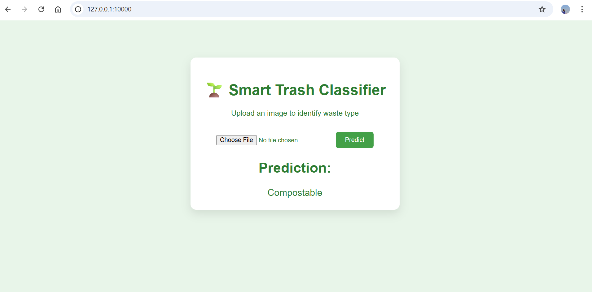

# 🌱 Smart Trash Classifier Web App

An environmental-friendly AI web application that classifies trash images into **General**, **Compostable**, or **Recyclable** categories using a Convolutional Neural Network (CNN).  
Built with **Flask** and **TensorFlow**.

---

## 🚀 Features
- 📸 Upload an image of trash for classification
- 🧠 Deep learning model (`my_model.h5`) for prediction
- ♻️ Waste categories:
  - General
  - Compostable
  - Recyclable
- 🌍 Clean and eco-friendly UI design

---

## 🛠️ Tech Stack
- **Frontend:** HTML, CSS  
- **Backend:** Flask (Python)  
- **Machine Learning:** TensorFlow / Keras   
- **Version Control:** Git & GitHub  

---

## 🧠 Model Information
- Custom CNN model trained on waste image data
- Input image size: **128 × 128 × 3**
- Convolutional and pooling layers for feature extraction
- Dense layers for classification
- Output: 3-class Softmax prediction

---

## 📸 Demonstration

Below is a sample demonstration of the Smart Trash Classifier web application.  
Users can upload an image of trash and receive an instant prediction result.

